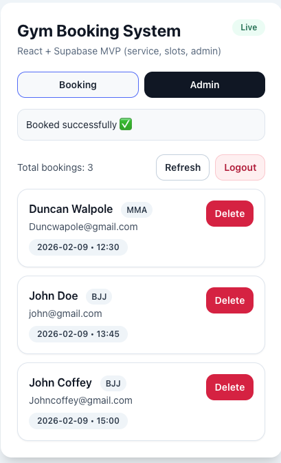
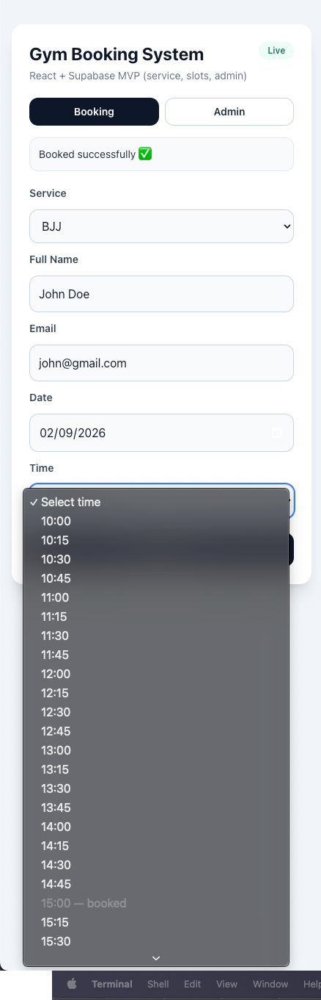
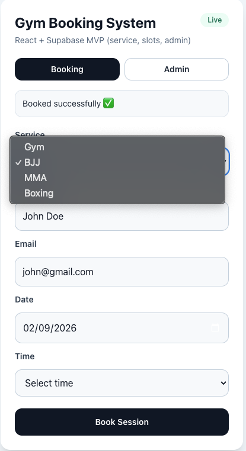

# Gym Booking System — React + Supabase MVP

🚀 Live Demo: https://gym-booking-mvp.vercel.app  
💻 GitHub Repository: https://github.com/ratikippiani1/gym-booking-mvp 

A production-style gym booking system built with React and Supabase.  
Includes service selection, automated time slots, admin dashboard and booking protection logic.

---

## 🚀 Features

### Client Side
- Service selection (Gym, BJJ, MMA, Boxing)
- Date picker with future-only booking validation
- Automatic time slot generation
- Already booked slots disabled
- Double booking prevention
- Responsive UI (mobile + desktop)

### Admin Panel
- Password protected admin access
- Persistent login (localStorage)
- View all bookings
- Delete bookings
- Manual refresh with loading state
- Auto reload on page refresh

### System Logic
- Business hours based scheduling
- Slot interval control (15 min)
- Input validation
- Backend row security
- Production deployment ready

---

## 🧠 Tech Stack

Frontend:
- React
- Tailwind CSS
- Vite

Backend:
- Supabase (PostgreSQL)
- Row Level Security (RLS)

Deployment:
- Vercel
- GitHub

---
## Screenshots

!

